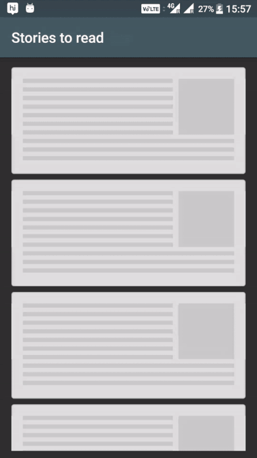
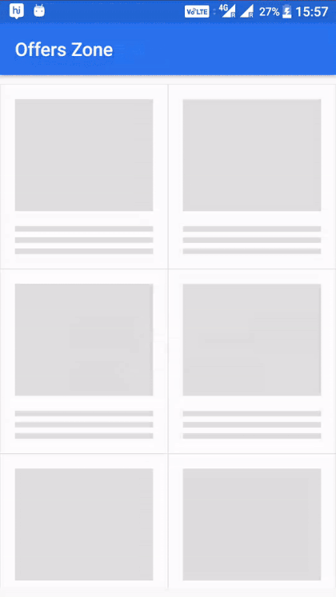
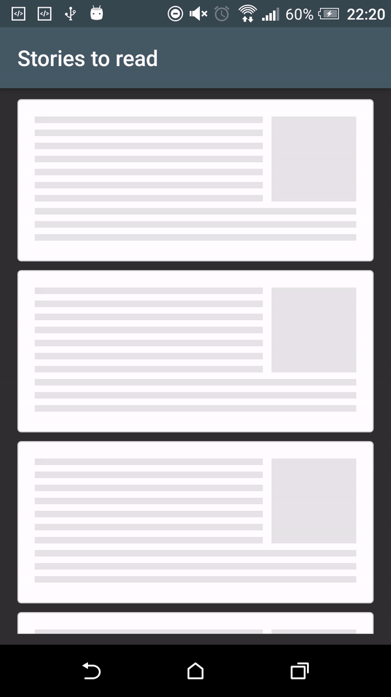
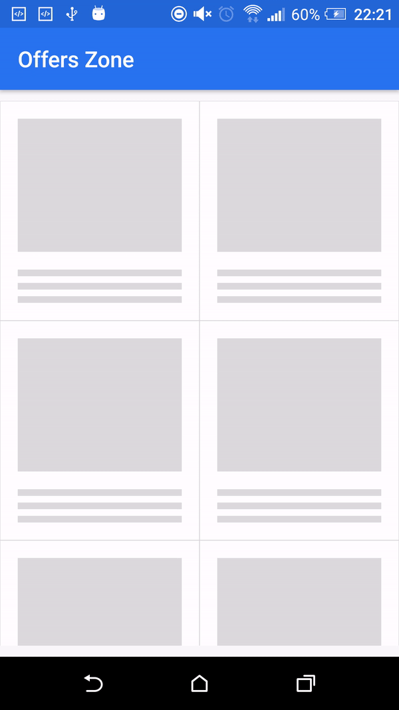

[](https://android-arsenal.com/details/1/5058)
[](https://travis-ci.org/sharish/ShimmerRecyclerView)

# ShimmerRecyclerView


Intro
------

A custom recycler view with shimmer views to indicate that views are loading. The recycler view has a built-in adapter to control the shimmer appearance and provide two methods -

* showShimmerAdapter() - set up a demo adapter a predefined number of child demo views.
* hideShimmerAdapter() - restores your adapter to show the actual child elements.

    
Demo Screen
------

There are two kinds of shimmer animation which you can see here:

1. This type of shimmer effect uses the whole ViewHolder item to animate on.

|     List Demo                |        Grid Demo              | 
| ----------------------------  | ----------------------------- | 
|  |    |

2. Here the shimmer effect only applied on for those views which background color is nontransparent.

|     List Demo                |        Grid Demo              |
| ----------------------------  | ----------------------------- |
|  |    |


### Shimmer effect types

1. As you can see the first demo examples show that the whole ViewHolder item is animated. To achieve the desired effect, the children of the ShimmerLayout should have a nontransparent background.
2. You can achieve the second kind of shimmer effect by adding only one ViewGroup child to the ShimmerLayout with a transparent background. This ViewGroup will have the other views with nontransparent backgrounds on which the effect will be seen.

   You may wonder how can you add background to the root view of the ViewHolder, if you do not have direct access to the ShimmerLayout and the only child has a nontransparent background. The solution for this is to use the `shimmer_demo_view_holder_item_background` attribute.

### Attributes and Methods

Following are the attributes and methods to initialise the demo views.

| XML Attributes | Java Methods | Explanation |
| -------------  | ------------ | ----------- | 
|```app:shimmer_demo_child_count``` | ```setDemoChildCount(int)``` | Integer value that sets the number of demo views should be present in shimmer adapter. |
|```app:shimmer_demo_layout``` | ```setDemoLayoutReference(int)``` | Layout reference to your demo view. Define your my_demo_view.xml and refer the layout reference here. |
|```app:shimmer_demo_layout_manager_type``` | ```setDemoLayoutManager(LayoutManagerType)``` | Layout manager of demo view. Can be one among linear_vertical or linear_horizontal or grid. |
|```app:shimmer_demo_shimmer_color``` | ``` - ``` | Color reference or value. It can be used to change the color of the shimmer line. |
|```app:shimmer_demo_angle``` | ``` - ``` | Integer value between 0 and 30 which can modify the angle of the shimmer line. The default value is zero. |
|```app:shimmer_demo_mask_width``` | ``` setDemoShimmerMaskWidth(float) ``` | Float value between 0 and 1 which can modify the width of the shimmer line. The default value is 0.5. |
|```app:shimmer_demo_view_holder_item_background``` | ``` - ``` | Color or an xml drawable for the ViewHolder background if you want to achieve the second type of shimmer effect. |
|```app:shimmer_demo_reverse_animation``` | ``` - ``` | Defines whether the animation should be reversed. If it is true, then the animation starts from the right side of the View. Default value is false. |


Usage
--------

Define your xml as:

```xml
<com.cooltechworks.views.shimmer.ShimmerRecyclerView
        xmlns:app="http://schemas.android.com/apk/res-auto"
        android:id="@+id/shimmer_recycler_view"
        android:layout_width="match_parent"
        android:layout_height="match_parent"
        app:shimmer_demo_child_count="10"
        app:shimmer_demo_grid_child_count="2"
        app:shimmer_demo_layout="@layout/layout_demo_grid"
        app:shimmer_demo_layout_manager_type="grid"
        app:shimmer_demo_angle="20"
        />

```
where ```@layout/layout_demo_grid``` refers to your sample layout that should be shown during loading spinner. Now on your activity onCreate, initialize the shimmer as below:

```java
ShimmerRecyclerView shimmerRecycler = (ShimmerRecyclerView) findViewById(R.id.shimmer_recycler_view);
shimmerRecycler.showShimmerAdapter();
```

Adding to your project
------------------------

- Add the following configuration in your build.gradle file.

```gradle
repositories {
    jcenter()
    maven { url "https://jitpack.io" }
}

dependencies {
    implementation 'com.github.sharish:ShimmerRecyclerView:v1.3'
}
```

Developed By
------------

* Harish Sridharan - <harish.sridhar@gmail.com>


Used libraries
----------------

* <a href="https://github.com/team-supercharge/ShimmerLayout">ShimmerLayout</a>: the library which achieves the shimmer effect in a memory efficient way.

License
--------
The repo is released under following licenses

<a href="LICENSE.md">Apache License</a> for ShimmerRecycler<br>
<a href="https://github.com/team-supercharge/ShimmerLayout/blob/master/LICENSE.md">Apache License</a> for ShimmerLayout


